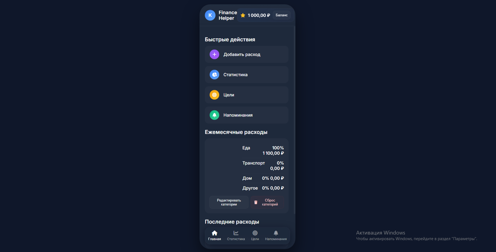

# Finance Helper — Мобильный финансовый помощник


*Красивый и полностью локальный трекер личных финансов в стиле мобильного приложения.  
Учёт расходов, статистика по категориям, цели накопления и напоминания — всё работает прямо в браузере, без сервера и подписок.*
  


**Основные возможности:**
- Добавление расходов: сумма, категория, комментарий, дата  
- Статистика по категориям с круговой диаграммой (на чистом CSS)  
- Цели накопления с прогресс-барами и внесением средств  
- Напоминания с датой/временем и удалением  
- Баланс с ручным редактированием  
- Тёмная тема, модальные окна, нижняя навигация  
- Всё сохраняется в localStorage — данные только у тебя, работает оффлайн  
- Responsive дизайн: имитация мобильного экрана, полноэкранный режим на телефоне  

**Технологии:**
- HTML5 (структура с секциями и модалками)  
- CSS (flex/grid, градиенты, clip-path для диаграммы, медиа-запросы)  
- Vanilla JavaScript (утилиты, рендер, события, localStorage)  
- Font Awesome (иконки) + Google Fonts (Inter)  

## Как запустить локально

1. Склонируй репозиторий  
   ```bash
   git clone https://github.com/klimyalta/finance-helper.git
   cd finance-helper
